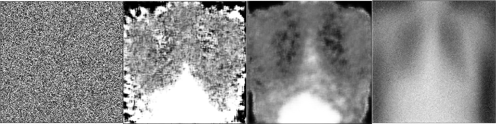

# chest-gan
Generating Chest X-Rays with GANs

## Motivation

The aim of this repository is to generate artificial chest x-ray images of 5 different
pathology classes using generative adversarial networks (GANs), with the goal
of improving classification accuracy for models tackling this problem space.

Since the availability of medical images is limited, it is difficult to collect
sufficiently large amounts of data for training performant classification models (e.g. Deep CNNs or Capsule Networks). Data augmentation has become stan dard in most application areas to help allay such difficulties, but most simple
conventional methods are insufficient for difficult for problems. Hence, we attempt to utilize GANs for the same purpose: generating additional samples of each class, allowing for enhanced classification performance.

The main motivation was to get better accuracy on classifying the pathologies, thereby reducing cases of misdiagnoses.

## Dataset

The [NIH Chest X-rays dataset](https://www.kaggle.com/nih-chest-xrays/data) we use is hosted by Kaggle and contains approximately 100k chest X-rays from more than 30,000 unique patients, composing 18 different pathology classes. In the interest of simplification, we limit our work to five: Atelectasis, Effusion, Pneumothorax, Cardiomegaly and No Finding (Normal).

